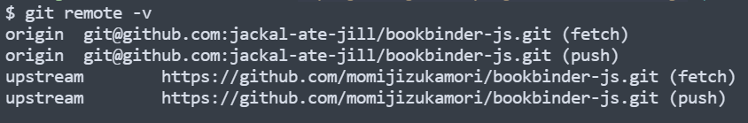

# Contribution Help
This guide is intended as a supplement to help folks who may be new to coding, the GitHub ecosystem, or the collaboration process; it includes additional details to the process described in [CONTRIBUTING.md](../CONTRIBUTING.md). If you run into issues that aren't covered here, please feel free to add the steps you took and documentation you consulted to resolve them! It may be a big help to a future coder out there.

Detailed instructions for tool installation and machine setup are outside the scope of this guide, but please feel free to reach out if you need assistance!

- If you're unsure whether you have the right tools installed, you can confirm you have these installed by running the following in your terminal: `node --version`, `npm --version`, and `git --version`
 	- if you do not see a version number as output, you will need to install the relevant tool, see links in [CONTRIBUTING.md](../CONTRIBUTING.md) (note: `npm` is generally part of the `node` installation and does not need to be installed separately)

- You can confirm your remotes are properly configured by running `git remote -v`; this should show your fork as the 'origin' repository and the parent as the 'upstream' repository, as in the following screenshot:
	

- If you are not acquainted with `git`, see general setup and practices [in GitHub's docs](https://docs.github.com/en/get-started/quickstart/set-up-git). As mentioned above, a detailed Git tutorial is outside the scope of this guide, but feel free to reach out for assistance if you'd like to contribute but aren't sure how to get started.

- Some notes on adding changes and making commits:
	- Add changes to your branch with `git add -A`
	- Commit changes with `git commit -m 'your commit message here'`
		- Commit messages should describe your changes succinctly, for example, `git commit -m 'add contributor documentation'`
